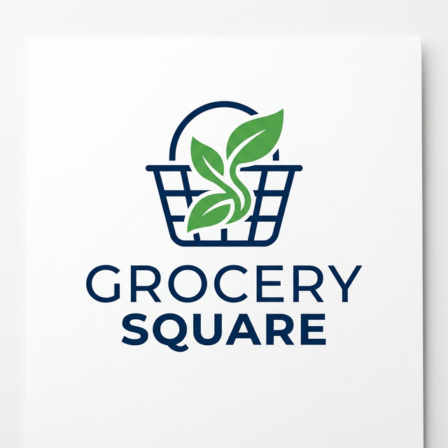

# 🛒 Grocery Square



A modern, fast, and fully-responsive e-commerce grocery storefront built with **Next.js**, styled with **Tailwind CSS**, and powered by **Supabase**.

## 🌐 Live Demo
Experience the premium storefront live: **[Grocery Square Live Demo](https://devendrasaim.github.io/GrocerySquare/)**

## ✨ Features
- **Premium User Interface**: Glassmorphism category grids, dynamic hover animations, and beautifully themed generic informational pages.
- **Full Product Catalog**: Extensive grocery categorizations including Fresh Produce, Bakery, Meat & Seafood, and custom Café n Curry meals.
- **Static Site Generation (SSG)**: Flawlessly pre-rendered and statically exported using Next.js `output: 'export'` for blazing-fast GitHub Pages delivery.
- **Supabase Integration**: Secure, real-time database structure powering live product inventories, seeded via a custom SQL script.
- **Robust Dynamic Routing**: Catch-all highly scalable Next.js `generateStaticParams` static routing to flawlessly handle over 20+ navigation and utility pages.
- **Offline Fallbacks**: Includes a rich local mock data layer guaranteeing seamless UI development even without live database connections.

## 💻 Tech Stack
- **Framework**: [Next.js](https://nextjs.org/) (App Router)
- **Styling**: [Tailwind CSS](https://tailwindcss.com/)
- **Database / Backend**: [Supabase](https://supabase.com/)
- **Icons**: [Lucide React](https://lucide.dev/)
- **CI/CD Deployment**: GitHub Actions directly to GitHub Pages

## 🚀 Getting Started locally

To run this project on your local machine:

### 1. Clone the repository
```bash
git clone https://github.com/devendrasaim/GrocerySquare.git
cd GrocerySquare
```

### 2. Install Dependencies
```bash
npm install
# or
yarn install
```

### 3. Setup Environment Variables
Create a `.env.local` file in the root directory and add your Supabase credentials:
```env
NEXT_PUBLIC_SUPABASE_URL=your_supabase_project_url
NEXT_PUBLIC_SUPABASE_ANON_KEY=your_supabase_anon_key
NEXT_PUBLIC_BASE_PATH=/GrocerySquare/
```

### 4. Run the Development Server
```bash
npm run dev
# or
yarn dev
```
Open [http://localhost:3000](http://localhost:3000) with your browser to see the result.

## 🗄️ Database Initialization
If deploying a fresh Supabase instance, execute the provided `scripts/001_initial_schema.sql` and `scripts/002_seed_data.sql` scripts sequentially inside the Supabase SQL editor to populate your live catalog.

## 📄 License
This project is open-source and available under the [MIT License](LICENSE).
